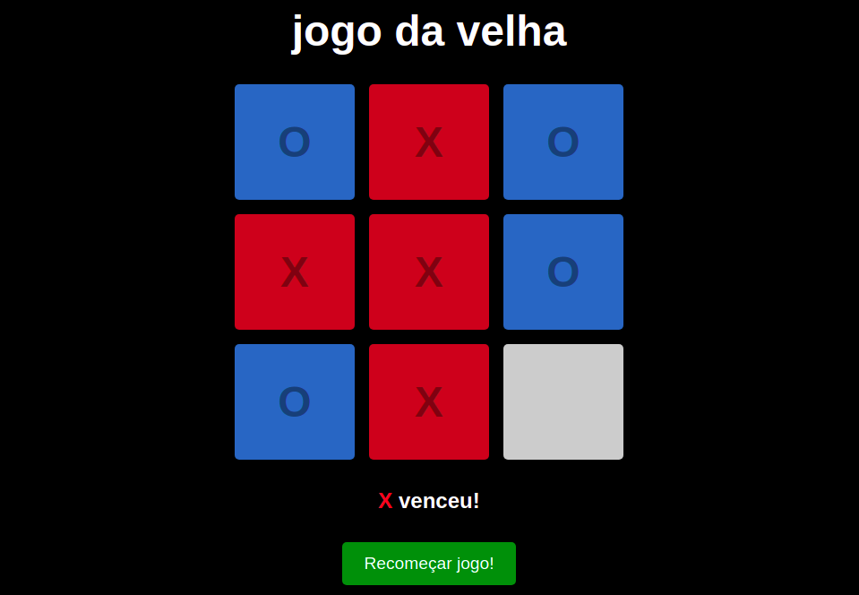

# Jogo da velha
O objectivo é conseguir três círculos ou três xis ou bolinhas em linha, quer horizontal, vertical ou diagonal.
## Desenvolvimento
 - Desenvolvido por <a href="https://www.linkedin.com/in/tiagoabranges/" target="_blank">tiagoabranges</a>.
 - Email:
   - tiagoabranges@gmail.com
   - Linkedin: <a href="https://www.linkedin.com/in/tiagoabranges/" target="_blank">tiagoabranges</a>

## Visualizar:
 - Primeiro clone o repositório:
    - ``` git clone git@github.com:T-abran/velha.git ```
 - Entre no repositório: 
    - ``` cd velha ```
 - Inicia o projeto:
    - ``` npm start ```
     <h3 align="left"> Foto do Projeto </h3>
 
